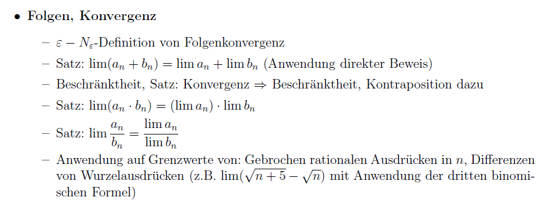
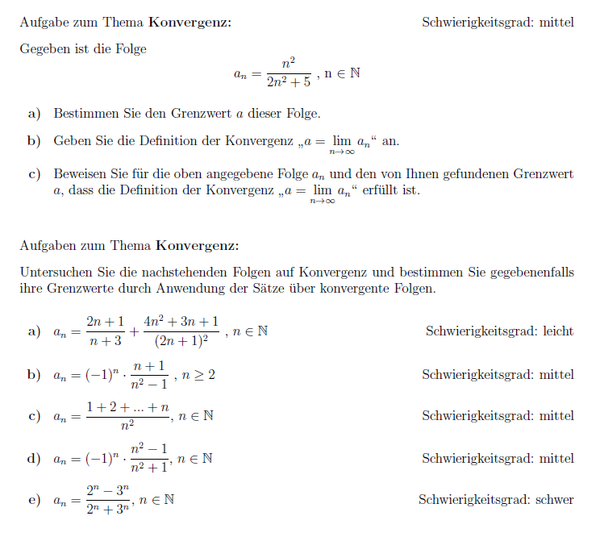

## Folgen


#### Anforderungen für die Zertifikatsklausur



#### Orientierungsaufgaben für das Uni-Zertifikat




#### SageMath

[SageMathCell](https://sagecell.sagemath.org/)


Der Buchstabe n bezeichnet in SageMath die Funktion, die eine Zahl in eine Dezimalzahl verwandelt, deswegen nutzen wir als Index der Folge den Buchstaben k.


```
a(k) = 2 - 2 * (-1)^k/k                             # Definition der Folge
print(limit(a(k), k=infinity))                      # Grenzwert berechnen
points([(k,a(k)) for k in range(1,50)])             # Plot der Punkte     
```


#### Online Aufgaben

[MathWeb](https://mathweb.de/mod/page/view.php?id=9) - Abschnitt Summen und Folgen ab *Eigenschaften von Folgen*
