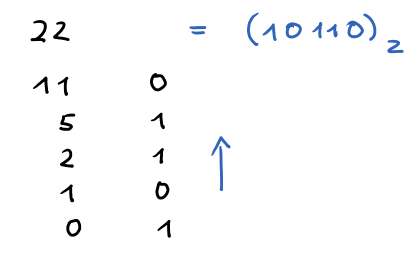
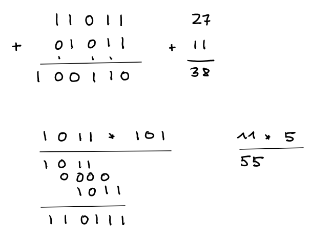
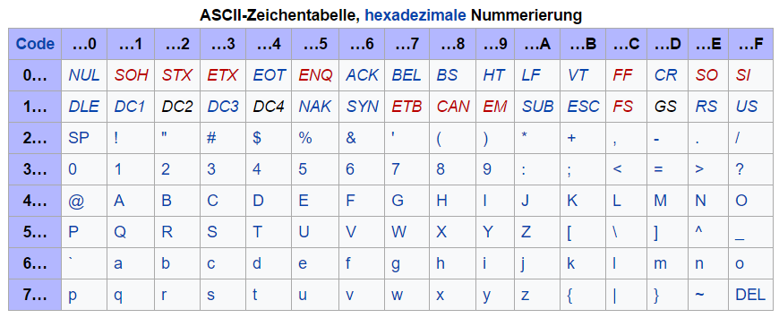
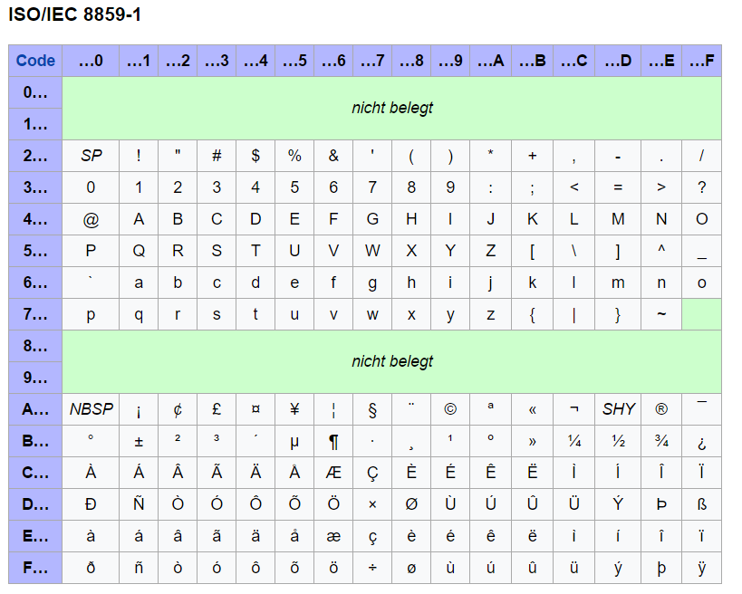
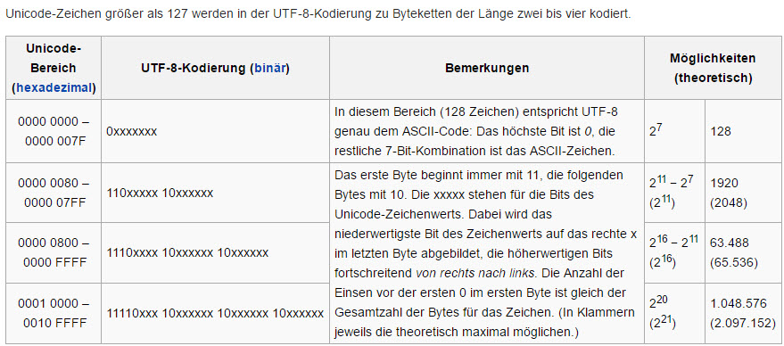

## Codierung

[Binärdarstellung](https://www.inf-schule.de/information/darstellunginformation/binaerdarstellungzahlen/konzept_dualsystem)

[Hexadezimaldarstellung](https://www.inf-schule.de/information/darstellunginformation/binaerdarstellungzahlen/konzept_hexadezimalsystem)

#### Stellenwertsysteme

Dezimalzahlen: 10 Ziffern: 0,1,2, ... 9 - Beispiel: 4719 <br>
Dualzahlen:  2 Ziffern: 0,1 - Beispiel: 10010 <br>
Oktalzahlen: 8 Ziffern: 0,1,2, ... 7 - Beispiel: 273<br>
Hexadezimalzahlen: 16 Ziffern: 0,1,2, ... 9, A, B, C, D, E, F- Beispiel: E52F

In einem Stellenwertsystem haben die Ziffern unterschiedliche Bedeutung, je nachdem an welcher Stelle sie stehen.


<!-- $(4719)_{10} =   9 \cdot 10^0 + 1 \cdot 10^1 + 7 \cdot 10^2 + 4 \cdot 10^3$ -->   <br>
<!-- $(273)_{8} =  3 \cdot 8^0 + 7 \cdot 8^1 + 2 \cdot 8^2 = (187)_{10}$ -->   <br>
<!-- $(10010)_{2} =   0 \cdot 2^0 + 1 \cdot 2^1 + 0 \cdot 2^2 + 0 \cdot 2^3 + 1 \cdot 2^4 = (18)_{10}$ -->    <br>
<!-- $(E52F)_{16} =  15 \cdot 16^0 + 2 \cdot 16^1 + 5 \cdot 16^2 + 14 \cdot 16^3 = (58671)_{10}$ --> 

#### Umrechnung Dezimal - Binär

Die rechte Ziffer in der Binärdarstellung einer Zahl wegstreichen bedeutet: die Zahl ganzzahlig durch 2 teilen.

<!-- $10110 / 2   =  ( 1 \cdot 2^4 +  0 \cdot 2^3 + 1 \cdot 2^2 + 1 \cdot 2^1 + 0 \cdot 2^0 ) / 2 =
(1 \cdot 2^3 + 0 \cdot 2^2 + 1 \cdot 2^1 + 1 \cdot 2^0 ) = 1011$ -->   

Wenn wir die 22 in ihre Binärdarstellung umwandeln wollen, erkennen wir sofort, wie das rechteste Bit aussieht. Für die übrigen Bits dividieren wir die 22 ganzzahlig durch 2 und wiederholen die Überlegung.



#### Rechnen mit Binärzahlen

Es gelten die üblichen Regeln.



#### Bitfolgen als Folge von hexadezimalen Ziffern

Je vier Bits einer Bitfolge fassen wir zu einer hexadezimalen Ziffer zusammen

```
0011 1110 1000
3    E    8
```

Übung: Wandle die Bitfolge in eine Folge von Vierergruppen von hexadezimalen Ziffern um.

```
1011 1111 0010 1100 0111 0101 0011 1101 0100 0101 1111 1110
```

#### Kodierung von Zeichen

Der ASCII-Code (American Standard Code for Information Interchange) sieht in seiner ursprünglichen Version 7 Bits zur Codierung von Zeichen vor. Damit lassen sich <!-- $2^7 = 128$ -->  Zeichen darstellen.  



[Zeichenfolge -> ASCII-Code](https://www.cryptool.org/de/cto/ascii)

ISO-8859-1 ist eine Erweiterung des ASCII-Codes auf 8 bit und reicht für die meisten westeuropäischen Sprachen aus. Es fehlt aber das Eurozeichen und einige französische Zeichen.





#### Unicode und UTF-8

Unicode ist ein internationaler Standard, der jedem Schriftzeichen aller bekannter Sprachen einen eindeutige Zahl zuordnet (Code Point).

[Unicode-CodeCharts](https://www.unicode.org/charts/)

UTF-8 ist die am weitesten verbreitete Codierung von Unicode-Zeichen



Übung: Ermittle den Codepoint Zeichens: 🥺 [pleading face](https://emojipedia.org/pleading-face/). Berechne dann mit der Tabelle die UTF-8 Codierung des Zeichens.

---

[Unicode-Miracle (Computerphile)](https://www.youtube.com/watch?v=MijmeoH9LT4)

[Decode-Unicode](https://decodeunicode.org/en)

[Emojipedia](https://emojipedia.org/)

[UTF-8 Converter](https://r12a.github.io/app-conversion/)

