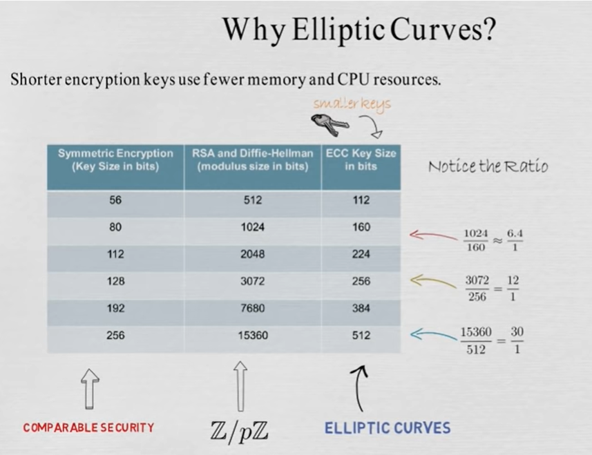
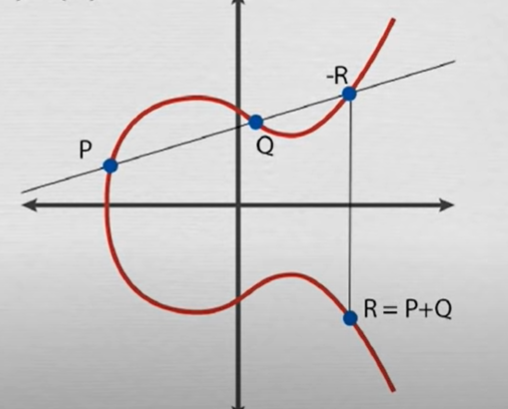
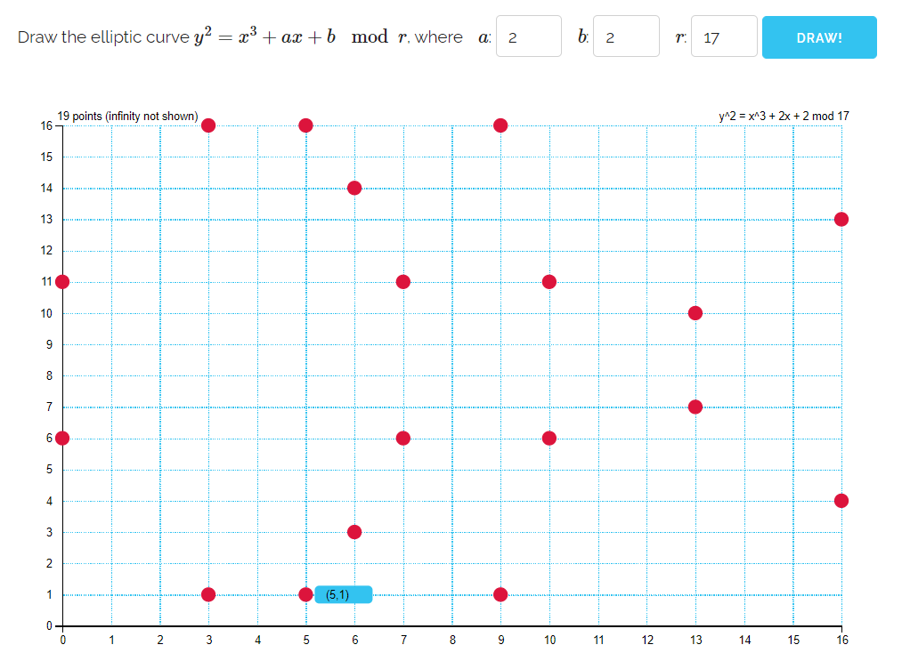
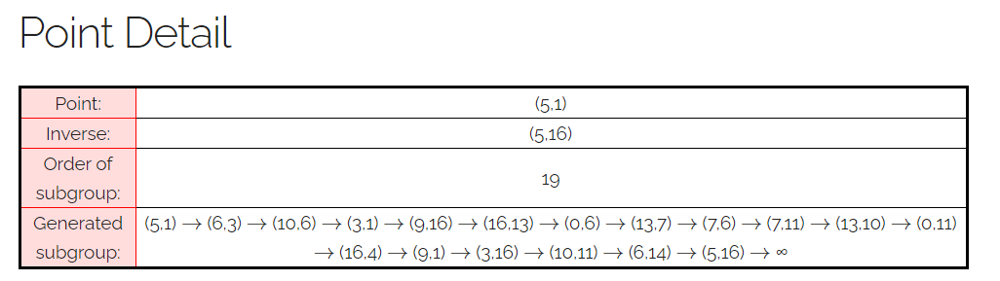

## Elliptische Kurven

Das Diffie-Hellman Verfahren zum Schlüsselaustausch kann auch mit elliptischen Kurven durchgeführt werden. Elliptische Kurven sind Punktmengen in der Ebene, die eine Gleichung der Form <!-- $y^2 = x^3 + ax + b$ -->  erfüllen, zusammen mit einem unendlich fernen Punkt <!-- $\{\infty\}$ --> , der die Rolle der Null übernimmt.

Das Verfahren ist mathematisch aufwendiger, führt aber dazu, dass dieselbe Sicherheit mit einer deutlich kürzeren Schlüssellänge erreicht wird.

----

Beim klassischen Diffie-Hellman vereinbaren Alice und Bob öffentlich eine Primzahl p und eine Primitivwurzel g als Generatorzahl. Alice und Bob behalten als ihr Geheimnis, wie oft sie die Generatorzahl mit sich selbst multiplizieren, veröffentlichen dann aber die Ergebnisse A und B. Daraus können beide den gemeinsamen Schlüssel K berechnen.

Beim Diffie-Hellman Verfahren mit elliptischen Kurven vereinbaren Alice und Bob öffentlich eine elliptische Kurve, einen Generatorpunkt G auf der Kurve und eine Primzahl modulo der gerechnet wird. Alice und Bob behalten dann wieder als ihr Geheimnis, wie oft sie diesem Generatorpunkt G zu sich selbst addieren, veröffentlichen dann aber die Ergebnisse A und B. Ganz analog können dann beide wieder den gemeinsamen Schlüssel K berechnen. 

Die Abbildung zeigt, was es bedeutet, zwei Punkte P und Q auf einer elliptischen Kurve zu "addieren".

---

Zu Beginn ist nur der Generatorpunkt G gegeben. Um zu 2G zu gelangen, wird als Gerade die Tangente an G genommen. 3G = 2G + G findet man dann wie in der Abbildung angedeutet. -G ist die Spiegelung an der x-Achse. G - G = 0 ist der unendlich ferne Punkt. Für den gilt dann auch G + 0 = G. Diese Definition der Addition zweier Punkte erfüllt alle Gesetze, die wir von der Addition von Zahlen kennen (Gruppenoperation).  

Aus den Koordinaten von P und Q lassen sich die Koordinaten von P+Q mit einer Formel berechnen. Alle Operationen dieser Formel werden modulo der vereinbarten Primzahl durchgeführt. Ausgehend von dem Generatorpunkt G ergeben sich so Punkte in der Ebene: G, 2G, 3G, ... . Wie beim klassischen Diffie-Hellman ist es bei geeigneter Wahl der Ausgangsparameter extrem aufwendig zu bestimmen, wie oft ein bekannter Punkt G zu sich selbst addiert wurde, damit ein gegebener Punkt A erreicht wird. 

### Beispiel:

<!-- $y^2 = x^3 + 2x + 2$, $p = 17, G = (5,1)$ --> 

So wie im klassischen Diffie-Hellman der Punkt auf dem Restklassenring herumspringt, so springt er hier wie zufällig in der Ebene herum.

Beispiel einer tatsächlich genutzten Kurve:  [Curve25519](https://en.wikipedia.org/wiki/Curve25519)

<!-- $y^{2}=x^{3}+486662x^{2}+x$ -->  mit <!-- $p = 2^{255}-19$ --> , der x-Wert des Generatorpunkts ist $x = 9$. Dadurch wird eine Gruppe von 
<!-- $ 2^{252}+27742317777372353535851937790883648493$ -->  Punkten erzeugt.

----

Links:

[Online Berechnung wie im Beispiel oben](https://graui.de/code/elliptic2/)  

[Sehr gute Erläuterung mit Beispiel](https://www.youtube.com/watch?v=F3zzNa42-tQ&t=228s)

[Computerphile](https://www.youtube.com/watch?v=NF1pwjL9-DE)

[Understanding ECC through the Diffie-Hellman Key Exchange](https://www.youtube.com/watch?v=gAtBM06xwaw) - Gute Einführung in die prinzipielle Funktionsweise mit den Pros und Cons.