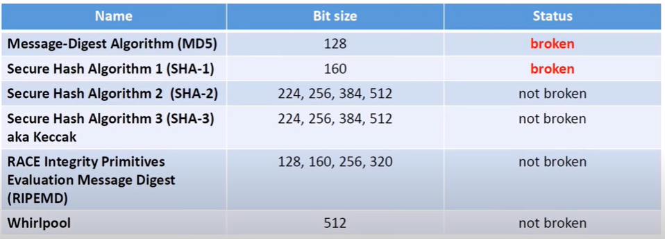
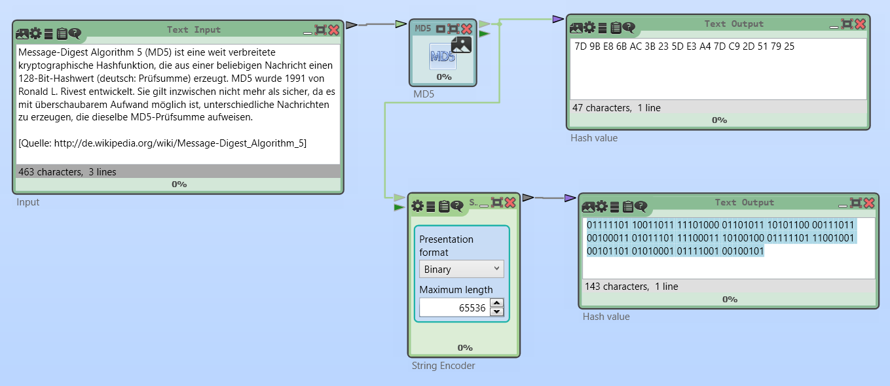
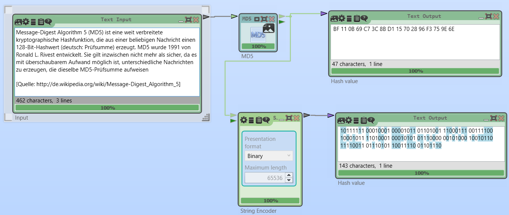

## Kryptographische Hashfunktionen

Beschreibung in: [Inf-Schule](https://www.inf-schule.de/kommunikation/kryptologie/digitalesignatur/konzept_hashfunktion)

Anwendungen:

* Verifikation der Integrität von Dateien
* Generieren von Signaturen
* Passwort Verifikation
* Proof-of-work

Beispiele:

## MD5-Beispiel

Das Beispiel zeigt den MD5-Hash in Cryptool2 in hex und binär. Im zweiten Bild fehlt der Punkt beim letzten Wort *aufweisen*. Bei der binären Ausgabe sind die Änderungen markiert. Bei guten Hash-Funktionen ändern sich bei jeder Änderung des Inputs im Schnitt 50% der Output-Bits.

## Links

[MD5-Beispiel in  Cryptool2](https://www.youtube.com/watch?v=Rwvpngxp438&t=582s)

[Ausführliche Darstellung der Bitoperationen des SHA-256 Algorithmus](https://www.youtube.com/watch?v=f9EbD6iY9zI)

[3Blue1Brown - Wie sicher ist ein sha256 Verschlüsselung?](https://www.youtube.com/watch?v=S9JGmA5_unY)

