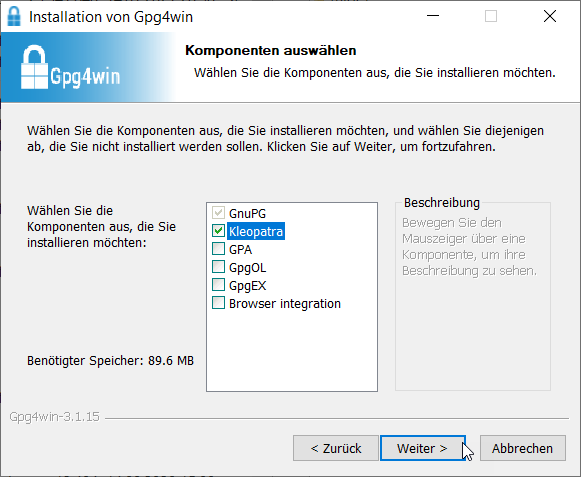
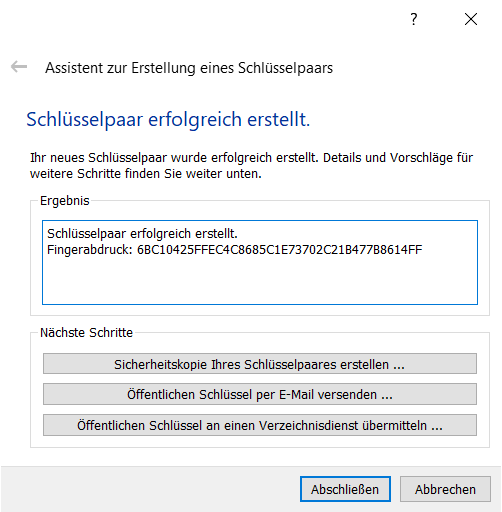
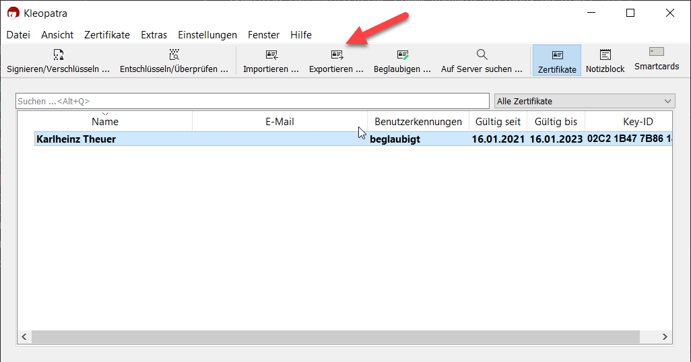
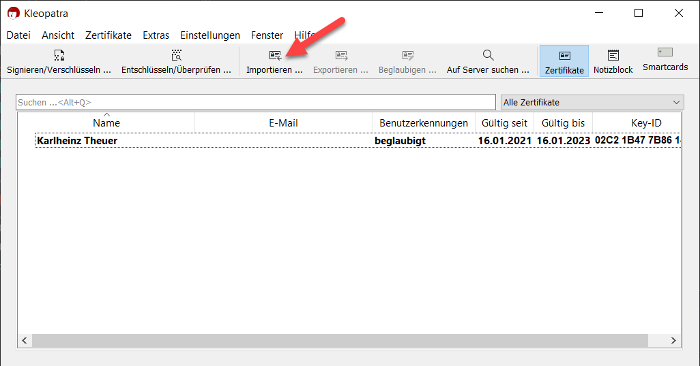
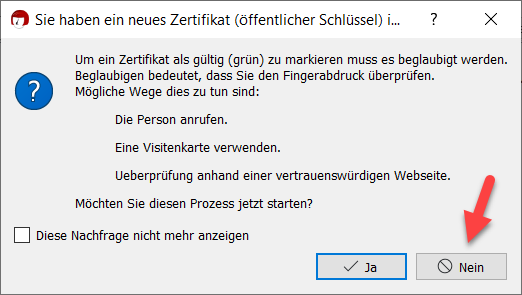
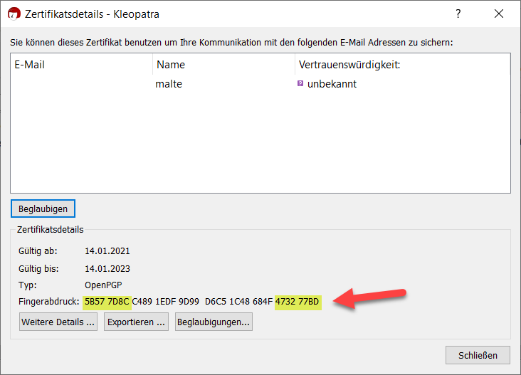
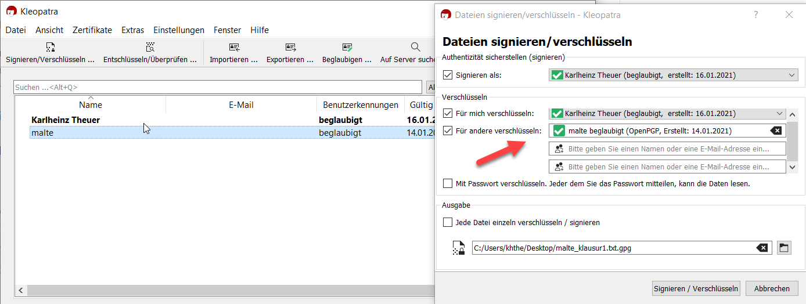

## Sicheres Email 

Download [Gpg4Win](https://www.gpg4win.de/index-de.html).  

Wir wählen eine möglichst schmale Installation, d.h. keine Integration in Outlook und keine
Integration in den Explorer, nur das Basisprogramm (GnuPG) und die Benutzeroberfläche (Kleopatra).

---

Nach der Installation Kleopatra starten. Auf der Willkommen-Seite *Neues Schlüsselpaar* anklicken.
Den Namen eintragen und *Passphrase* (= Passwort) ankreuzen.  Nach der Schlüsselgenerierung auf *Abschließen*  klicken. 

---

### Den öffentlichen Schlüssel an den Kommunikationspartner schicken

Den Schlüssel anklicken und *exportieren* wählen.

Die erzeugte Datei enthält den öffentlichen Schlüssel, das Wort *public* kommt im Dateinamen vor, z.B: *name_0x7B8614FF_public.asc*. Diese Datei mit normalem email an die Kommunikationspartner verschicken.

----

### Import des öffentlichen Schlüssel des Kommunikationspartners

Wir erhalten von Malte eine email, in der er uns seinen öffentlichen Schlüssel in Form eines Dateianhangs zuschickt: *malte_0x473277BD_public.asc*. Wir klicken auf importieren und wählen die erhaltene Datei.

----

 Wir können zunächst nicht sicher sein, dass diese email wirklich von Malte stammt oder vielleicht unterwegs verändert wurde. Deswegen erscheint der Hinweis, dass der öffentliche Schlüssel, den wir erhalten haben, beglaubigt werden muss (seine Authentizität muss sicher gestellt sein). Wir machen das in einem späteren Schritt und klicken hier auf *nein*. Der Schlüssel von Malte erscheint in der Übersicht als *nicht beglaubigt*.
 

----

### Beglaubigung des öffentlichen Schlüssel des Kommunikationspartners

 Da wir Malte (und seine Stimme) kennen, lassen wir uns von ihm bei einer MS-Teams Sitzung (oder per Telefon) den Fingerprint seines öffentlichen Schlüssels vorlesen. 
 Wir selektieren den Schlüssel von Malte, dann rechter Mausklick und *Details* wählen:

 Malte liest die ersten 8 und die letzten 8 Zeichen des Fingerprints seines öffentlichen Schlüssels vor. Wenn diese Zeichen mit denen übereinstimmen, die wir beim Fingerprint sehen, können wir sicher sein, dass der öffentliche Schlüssel von Malte während des email-Transports nicht verändert wurde.
und klicken auf *Beglaubigen*.

 

 ----

 ### Eine verschlüsselte email an den Kommunikationspartner schicken 

 Da wir bei der Installation keine Integration mit z.B Outlook gewählt haben, können wir  verschlüsselte Dateien nur als Anhang verschicken. Wir können den zu verschlüsselnden Text also nicht direkt in Outlook eingeben, sondern schreiben ihn in ein Word-Dokument oder eine einfache Textdatei. 

 Wir wählen Maltes Schlüssel, klicken auf *Signieren/Verschlüsseln* und wählen die Datei aus, die wir verschlüsseln wollen. In dem dann erscheinenden Fenster *Dateien signieren/verschlüsseln* wählen wir *Für andere verschlüsseln* und selektieren dort Maltes öffentlichen Schlüssel. 
 Wenn wir *Für mich verschlüsseln* selektiert lassen, können außer Malte auch wir die Nachricht wieder entschlüsseln. Ganz unten steht der Name der Ausgabedatei vom Typ *gpg*. 
 Wir klicken auf *Signieren/Verschlüsseln*. 

 

 Die verschlüsselte Datei können wir jetzt als Anhang mit einem normalen email verschicken. 

 ---

 ### Eine erhaltene Datei entschlüsseln

 Wir klicken auf  *Entschlüsseln/Überprüfen* und wählen die zu entschlüsselnde gpg-Datei.

Die erhaltene Datei enthält nicht nur die verschlüsselte Nachricht, sondern auch die Signatur des Senders. Um diese zu überprüfen, muss der Empfänger den öffentlichen Schlüssel des Senders importiert haben. Damit wird sichergestellt, dass die Nachricht wirklich vom Sender kommt. 
Wenn der Empfänger auf diese Sicherheit verzichten kann, kann er die Entschlüsselung auch ohne den öffentlichen Schlüssel des Senders durchführen. 
Es kommt dann eine Warnung, aber die Entschlüsselung funktioniert trotzdem.

---

 Für MacOS kann die [GPGSuite](https://gpgtools.org/) verwendet werden.

 